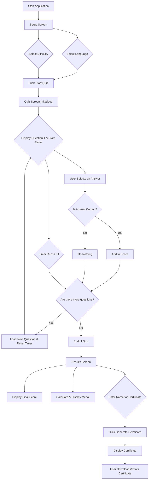

# Application Flowcharts

This document contains detailed flowcharts describing the user flow and system architecture of the Cybersecurity Quiz Application.

## Detailed User Flow Diagram

This flowchart illustrates the step-by-step journey a user takes when interacting with the application, from initial setup to certificate generation.



## Detailed System Architecture Diagram

This diagram provides a more granular view of the system's components and how they interact. It shows the frontend React components and the conceptual backend services.

```mermaid
graph TD
    subgraph User Interaction
        U[User]
    end

    subgraph Frontend (React Application)
        subgraph Components
            C1[App.tsx - Main Router]
            C2[SetupScreen.tsx]
            C3[QuizScreen.tsx]
            C4[ResultScreen.tsx]
            C5[Certificate.tsx]
        end
        subgraph State & Logic
            S1[React Hooks (useState, useEffect)]
            S2[i18n JSON files]
            S3[Quiz Data (questions.json)]
            S4[Utility Functions (scoring, timer)]
        end
    end

    subgraph Conceptual Backend (Node.js)
        B1[API Gateway]
        B2[Auth Service]
        B3[Quiz Content Service]
        B4[User Profile Service]
        B5[Database (e.g., MongoDB)]
    end

    U --> C1;
    C1 --> C2;
    C2 -- User Choices --> C3;
    C3 -- Uses --> S1;
    C3 -- Loads --> S2;
    C3 -- Loads --> S3;
    C3 -- Uses --> S4;
    C3 -- Quiz Completes --> C4;
    C4 -- Generates --> C5;
    
    C1 -->|API Calls (Future)| B1;
    B1 --> B2;
    B1 --> B3;
    B1 --> B4;
    B2 --> B5;
    B3 --> B5;
    B4 --> B5;
```
